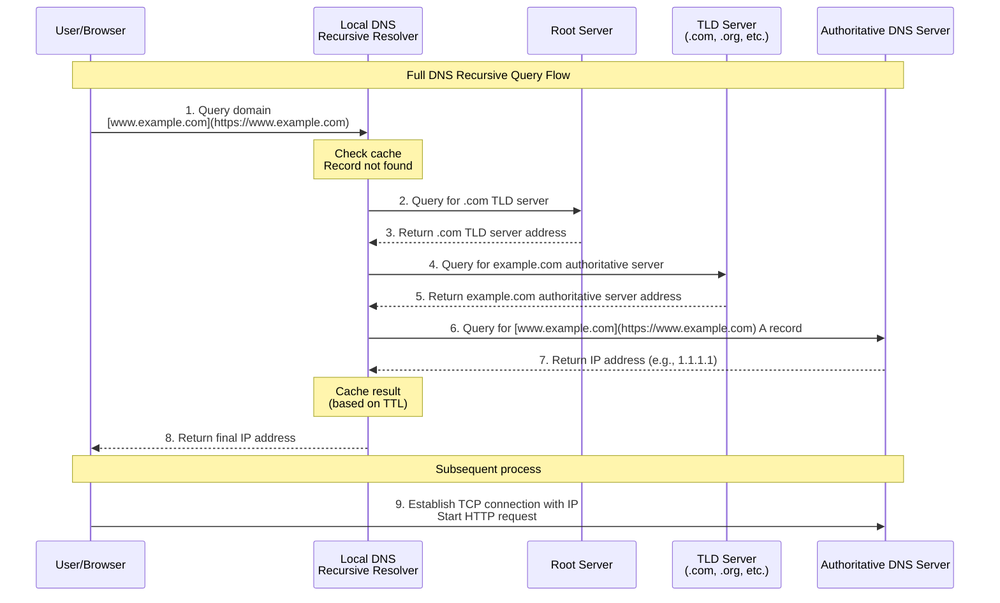

When we talk about website performance, we usually focus on front-end rendering, lazy loading of resources, server response time (TTFB), and so on. However, before the user's browser can even begin to request content, there is a crucial part that is rarely mentioned in performance optimization: DNS resolution. For obscure small sites, a "DNS Cache Miss," or what I call a "DNS Cold Start," can become an unavoidable performance bottleneck. This is the "Stone of Sisyphus" mentioned in the title.

## The Myth's Metaphor: The Long Journey of DNS Resolution

To understand the weight of this "stone," we must review the complete path of DNS resolution. This isn't a simple lookup, but a global relay race:

1.  **Starting Point: Public DNS Server** — A user sends a request, and the public DNS server tries to find the answer in its cache.
2.  **The First "Push": Root Servers** — Cache Miss. The public DNS server is directed to one of the 13 root server groups worldwide.
3.  **The Second Leg: TLD Servers** — The root server points to the Top-Level Domain (TLD) server for the specific suffix (like `.com`).
4.  **The Third Leg: Authoritative Servers** — The TLD server points to the domain's final "steward"—the Authoritative DNS Server.
5.  **The Finish Line:** The authoritative server returns the final IP address, which is then returned to the user by the public DNS server.

For a **first-time** or **long-unvisited** request, this process means at least 4 network round-trips (RTT), and even more in cases involving CNAMEs. For large websites with perfect caching, this stone may have already been pushed to the hilltop by someone else. But for a small site, it is always at the foot of the hill, waiting for its Sisyphus.

## A Multiverse: The Mirror Maze of Anycast

"Since the cost of a DNS cold start is so high, can I use a script to periodically visit my own site to 'warm up' the public DNS cache in advance?" — This was a solution I once envisioned.

However, this idea is often futile under the Anycast architecture of the modern internet.

The core concept of Anycast is: the same IP address exists at multiple global nodes simultaneously, and user requests are routed to the "closest" or "most optimal network path" node.

This means that public DNS servers like Google DNS (8.8.8.8), Cloudflare DNS (1.1.1.1), AliDNS (223.5.5.5), and Tencent DNS (119.29.29.29) are not backed by a single, centralized server, but a cluster of nodes distributed worldwide, routed dynamically.

Thus, the problem arises:

-   The pre-warming script I run in Shanghai might hit the Shanghai node of 223.5.5.5;
-   But a visitor from Beijing will be routed to the Beijing node of 223.5.5.5;
-   The caches of these two nodes are **independent and not shared with each other.**

From a webmaster's perspective, the DNS cache is no longer a predictable entity but has splintered into a "mirror maze" of geographically isolated, ever-changing fragments.

Each visitor is at the base of a different hill, pushing their own stone, as if there are thousands of Sisyphuses in the world, walking their own paths alone.

## Uncontrollable Caching and the "Normalization" of Cold Starts

This also explains why even if a small site is visited regularly by a script, real visitors might still experience significant DNS latency. Because "pre-warming" is only locally effective—it warms the cache of one Anycast node, not the entire network. And when the TTL expires or the cache is cleared by the public DNS server's algorithm (like LRU), this warmth quietly dissipates.

From a macro perspective, this traps "low-traffic sites" in a kind of fatalistic loop:

1.  Due to low traffic, cache hits are rare;
2.  Due to cache misses, resolution time is high;
3.  Due to high resolution time, first-paint performance is poor, and users visit less;
4.  Due to fewer user visits, the cache is even harder to hit.

The cold start is no longer an occasional "accident," but a passive "new normal."

## Can We Make the Stone Lighter? — Strategies to Mitigate Cold Start Impact

The predicament of Sisyphus seems unsolvable, but we are not entirely powerless. While we cannot completely eliminate the DNS cold start, we can significantly reduce the weight of this stone through a series of strategies and shorten the time it takes to be pushed back up the hill after each time it rolls down.

### The Art of the Trade-off: Adjusting DNS TTL (Time-To-Live)

TTL (Time-To-Live) is a critical value in a DNS record. It tells recursive resolvers (like public DNS, local caches) how long they can cache a record, although they might still be evicted by an LRU algorithm.

Lengthening the TTL can effectively increase the cache hit rate, reduce DNS cold starts, and keep Sisyphus's stone at the top of the hill for as long as possible.

But lengthening the TTL comes at the cost of flexibility: if you need to change the IP address for your domain for any reason, an overly long TTL might cause visitors to retrieve a stale IP address for a long time.

### Choosing a Faster "Messenger": Using the Right Authoritative DNS Server

The "last mile" of DNS resolution—the time it takes to get from the public DNS server to your authoritative DNS server—is equally critical. If the Nameserver service your domain uses responds slowly, has few global nodes, or is too far from the public DNS server the visitor is querying, then the entire resolution chain will still be slowed down by this final link, even if the user's public DNS node is nearby.

If I were writing this blog post in English, I would just say to switch your Nameserver to a top-tier provider like Cloudflare or Google, and be done with it. These large companies offer free authoritative DNS hosting, have numerous nodes around the world, and are very professional and trustworthy in this regard.

But I am currently using Simplified Chinese. According to my blog's statistics, most of my readers are from mainland China, and the public DNS servers they query are most likely also deployed in mainland China. Whereas Cloudflare/Google Cloud DNS have no authoritative DNS server nodes in mainland China, which will slow things down. So **if your visitors are primarily from mainland China, you might want to try AliYun (Alibaba Cloud) or Dnspod**. Their main authoritative DNS server nodes are within mainland China, which, in theory, can reduce the communication time between the public DNS server and the authoritative DNS server.

## Conclusion: The Stone Pusher

There has never been a perfect solution to the problem of DNS cold starts. It's like a fated "poetry of latency" within the internet's architecture—each visitor starts from their own network topology, pushing their own stone step-by-step along an invisible path, until they reach the summit of your server, in exchange for the first pixel lighting up on their screen.

For small sites, this may be the weight of destiny; but to understand it, optimize it, and monitor it, is how we, on this long uphill road, polish the stone's edges to make them smoother.

## See Also

- [Performance Benefits | Public DNS | Google for Developers](https://developers.google.com/speed/public-dns/docs/performance)
- [How do DNS queries affect website latency? - falconcloud.ae](https://falconcloud.ae/about/blog/how-do-dns-queries-affect-website-latency/)
