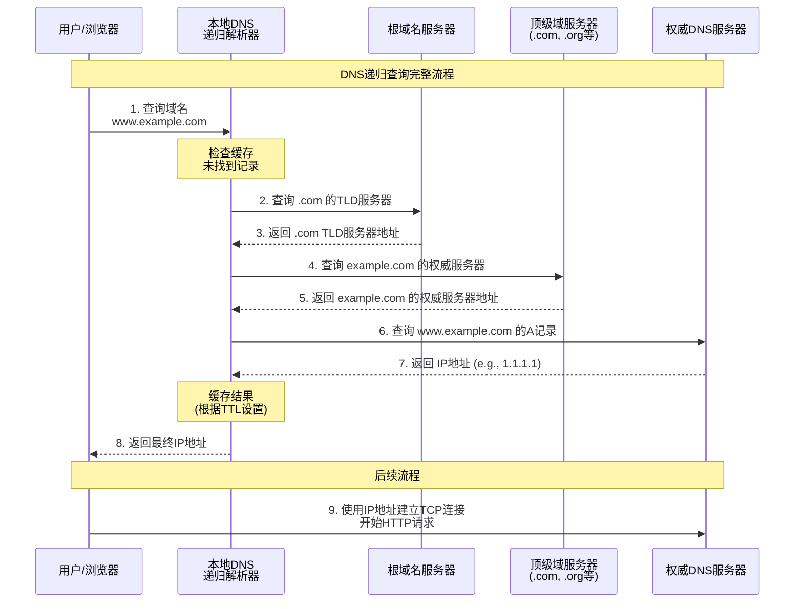

当我们谈论网站性能时，我们通常关注前端渲染、资源懒加载、服务器响应时间（TTFB）等。然而，在用户浏览器真正开始请求内容之前，有一个至关重要却鲜少在性能优化方面被提及的部分—— DNS 解析。对于默默无闻的小型站点而言，“DNS Cache Miss”（缓存未命中）或我称之为“DNS 冷启动”，会成为绕不过去的性能瓶颈，也就是本文标题所提到的“西西弗斯之石”。

## 神话的隐喻：DNS 解析的漫长旅程

要理解这块“石头”的重量，我们必须重温 DNS 解析的完整路径。这并非一次简单的查找，而是一场跨越全球的接力赛：

1. **起点：公共 DNS 服务器** — 用户发出请求，公共 DNS 服务器尝试在缓存中寻找答案。
2. **首次“推石”：根服务器** — 缓存缺失（Cache Miss），公共 DNS 服务器被引向全球 13 组根服务器。
3. **第二程：TLD 服务器** — 根服务器指向特定后缀（如 `.com`）的顶级域名服务器。
4. **第三程：权威服务器** — TLD 服务器指向网站域名最终的“管家”——权威 DNS 服务器。
5. **终点：** 权威服务器返回最终的 IP 地址，再由公共 DNS 服务器返回给用户。

对于**首次**或**长时间未访问**的请求，这个过程意味着至少 4 次网络往返（RTT），而在涉及到 CNAME 等情况时则会更多。对于那些拥有完美缓存的大型网站来说，这块石头可能已被别人推到了山顶；但对小型站点，它总是在山脚等待它的西西弗斯。

## 多重世界：Anycast 的镜像迷宫

 “既然 DNS 冷启动的代价如此之高，那我能否使用脚本定时访问自己的网站，提前让公共 DNS 缓存预热起来呢？”——这是我曾经设想的解题思路。

然而，这一思路在现代互联网的 Anycast（泛播）架构下，往往徒劳无功。

Anycast 的核心理念是：同一个 IP 地址在全球多个节点同时存在，用户请求会被路由到“距离最近”或“网络路径最优”的节点。

这意味着，Google DNS (8.8.8.8) 、Cloudflare DNS (1.1.1.1)、阿里 DNS (223.5.5.5)、腾讯 DNS (119.29.29.29) 等公共 DNS 服务器背后并不是一台中心化的服务器，而是一组分布在世界各地、动态路由的节点集群。

于是问题出现了：

- 我在上海运行的预热脚本，也许命中了 223.5.5.5 的上海节点；
- 但来自北京的访问者，却会被路由到 223.5.5.5 的北京节点；
- 这两个节点的缓存，**彼此独立、互不共享。**

从站长的视角来看，DNS 缓存不再是一个可预测的实体，而是分裂成一片片地理隔离、随时可变的“镜像迷宫”。

每个访客都在不同的山脚下推着自己的那块石头，仿佛世界上有成千上万个西西弗斯，孤独地在各自的路径上前行。

## 不可控的缓存与「冷启动的常态化」

这也解释了为什么即便一个小型网站有规律地被脚本访问，仍可能在真实访客那里出现明显的 DNS 延迟。因为「预热」只是局部生效 —— 它温暖的是某一个任播节点的缓存，而不是整个网络的全貌。而当 TTL 到期或缓存被公共 DNS 服务器采用 LRU 等算法清理时，这份温度也会悄然散去。

从宏观上看，这让“小流量站点”陷入了某种宿命循环：

1. 因访问量低，缓存不易命中；
2. 因缓存不命中，解析耗时高；
3. 因解析耗时高，首屏性能差，用户更少访问；
4. 因用户更少访问，缓存更难命中。

冷启动不再是偶发的“意外”，而是一种被动的“常态”。

## 我们能否让石头变轻？—— 减缓冷启动影响的策略

西西弗斯的困境看似无解，但我们并非完全无能为力。虽然无法彻底消除 DNS 冷启动，但通过一系列策略，我们可以显著减轻这块石头的重量，缩短它每次滚落后被推上山顶的时间。

### 权衡的艺术：调整 DNS TTL (Time-To-Live)

TTL（生存时间）是 DNS 记录中的一个关键值，它告知递归解析器（如公共 DNS、本地缓存）可以将一条解析记录缓存多久，尽管他们可能会被 LRU 算法淘汰。

拉长 TTL 可以有效提高缓存的命中率，减少 DNS 冷启动的情况，尽可能让西西弗斯之石保留在山顶上。

但拉长 TTL 是以牺牲灵活性作为代价的：如果你因为某些原因需要更换域名做对应的 IP 地址，过长的 TTL 可能会导致访客在很长一段时间内取得的都是已经失效的 IP 地址。

### 选择更快的“信使”：使用合适的权威 DNS 服务器

DNS 解析的最后一公里——从公共 DNS 服务器到你的权威 DNS 服务器——的耗时同样至关重要。如果你的域名所采用的 Nameserver 服务响应缓慢、全球节点稀少、又或者距离访客所请求的公共 DNS 服务器距离太远，那么即使用户的公共 DNS 节点就在身边，整个解析链条依然会被这最后一环拖慢。

如果我正在写的是一篇英文博客，那么我只需要说把 Nameserver 换成 Cloudflare、Google 等一线大厂就完事了。这些大厂提供免费的权威 DNS 托管业务，且在全球各地拥有大量节点，在这方面是非常专业且值得信赖的。

但我现在正在使用简体中文，根据我的博客统计数据，我的读者大多来自中国大陆，他们的站点访客大多也来自中国大陆，他们请求的公共 DNS 服务器大概率也都部署在中国大陆，而 Cloudflare/Google Cloud DNS 完全没有权威 DNS 服务器的中国大陆节点，这会拖慢速度。所以**如果你的访客主要来自中国大陆境内，或许可以试试阿里云或者 Dnspod**，他们主要的权威 DNS 服务器节点都在中国大陆境内，这在理论上可以减少公共 DNS 服务器与 权威 DNS 服务器之间的通信时长。

## 结语：推石头的人

DNS 冷启动的问题，从未有完美的解决方案。它像是互联网架构中注定存在的一段“延迟的诗意”——每个访问者都从自己的网络拓扑出发，沿着看不见的路径，一步步推着那块属于自己的石头，直到抵达你的服务器山顶，换得屏幕上第一个像素的亮起。

对小型站点而言，这或许是命运的重量；但理解它、优化它、监测它，便是我们在这条漫长上坡路上，为石头磨出更光滑的棱角。

### 参见

- [Performance Benefits  |  Public DNS  |  Google for Developers](https://developers.google.com/speed/public-dns/docs/performance)
- [How do DNS queries affect website latency? - falconcloud.ae](https://falconcloud.ae/about/blog/how-do-dns-queries-affect-website-latency/)