In my [previous blog post](/en/2025/11/11/dns-cold-start-dilemma/), I mentioned a core insight: **For small sites with low traffic and geographically dispersed visitors, DNS cold start isn't an occasional "accident" but rather a passive "norm."**

For most webmasters, site traffic doesn't increase overnight, so our visitors will likely need to go through the complete DNS resolution process. In the previous post, I discussed switching to authoritative DNS servers that are physically closer to visitors to improve speed, but **TLD (Top-Level Domain) Nameservers are beyond our control** — specifically, the portion highlighted in red in the diagram below.

```mermaid
sequenceDiagram
    autonumber
    participant User as User/Browser
    participant Local as Local DNS<br>Recursive Resolver
    participant Root as Root Nameserver
    participant TLD as TLD Server
    participant Auth as Authoritative DNS Server

    Note over User,Auth: Complete DNS Recursive Query Process

    User->>Local: Query domain www.example.com
    Note over Local: Check cache (MISS)

    Local->>Root: Query .com TLD server
    Root-->>Local: Return .com TLD server address

    %% --- Highlighted section begins ---
    rect rgb(255, 235, 235)
        Note right of Local: ⚠️ Core focus of this article <br> (TLD resolution latency)
        Local->>TLD: Query authoritative server for example.com

        Note left of TLD: Physical distance and Anycast capability<br>determine whether hundreds of ms delay exists

        TLD-->>Local: Return authoritative server address for example.com
    end
    %% --- Highlighted section ends ---

    Local->>Auth: Query A record for www.example.com
    Auth-->>Local: Return IP address (e.g., 1.1.1.1)

    Note over Local: Cache result (TTL)

    Local-->>User: Return final IP address

    User->>Auth: Establish TCP connection / HTTP request
```



So, if you haven't purchased a domain yet but want to pursue the ultimate first-screen loading time like a true geek (even if you don't have many visitors), which TLD should you choose?

## Simple Test

A simple method is to directly ping the TLD's nameserver to see how long it takes for the public DNS server requested by visitors to complete this segment of resolution.

Taking my domain zhul.in as an example, on Linux, you can use the `dig` command to obtain the Nameservers for the `in` TLD:

```bash
dig NS in.
```


Then you can pick any Nameserver (public DNS servers actually have a selection strategy based on historical performance) and directly ping that domain:


My network environment here is Hangzhou Mobile. If I run a DNS recursive server on my local network, this result represents the minimum time required for the red portion in the sequence diagram above (the DNS server needs additional time to process the request).

Using multi-location ping latency tests provided by some websites, we can infer in which countries or regions this TLD has deployed Anycast nodes. Below is the result provided by iplark.com.


We can infer that the .in TLD Nameserver has deployed Anycast nodes in at least Japan, Hong Kong, USA, Canada, Europe, Australia, Brazil, India, South Africa, and other locations, while latency within mainland China is relatively high.

***

As a comparison, we can use the same method to examine the Anycast nodes for the .cn domain's TLD Nameserver.


According to tests by itdog.cn, the .cn domain's TLD Nameserver may only have nodes in Beijing.

## A More Advanced Testing Approach

The above testing method is only a simple judgment method. In reality, many external factors affect DNS cold start resolution time:

- Peering exists between public DNS servers and TLD Nameservers, making their communication very fast
- The TLD Nameserver has poor performance, requiring an additional tens of milliseconds to process your request
- Among the TLD's several Nameservers, some are faster than others, and the public DNS server you use can select the faster one based on historical data
- ...

Therefore, we need a testing approach based on actual DNS resolution requests.

Testing DNS cold start has always faced a dilemma — we don't manage public DNS servers and cannot log in to manually clear their cache, so only the first test result may be valid, with subsequent requests hitting the cache. However, this time we're testing the latency between the public DNS server and the TLD Nameserver. With Gemini's reminder, I realized we could test the resolution time for random, non-existent domains across different regions using public DNS, which can reflect differences between various TLDs.

So, the test code is below. You can use bash on common Linux systems to execute this code. Ensure you have the dig and shasum commands installed, and I recommend using tools like screen/tmux to run it in the background, as the entire testing process may last over ten minutes. If your network environment is within mainland China, I suggest changing the public DNS server in the code to 223.5.5.5 / 119.29.29.29, which should better match the usage environment of domestic visitors.

```bash
#!/bin/bash

# ================= Configuration Section =================
# CSV filename
OUTPUT_FILE="dns_benchmark_results.csv"

# DNS server
DNS_SERVER="8.8.8.8"

# List of TLDs to test
# Includes: global generic (com), country code (cn, de), popular tech (io, xyz), and potentially slower suffixes
TLDS_TO_TEST=("com" "net" "org" "cn" "in" "de" "cc" "site" "ai" "io" "xyz" "top")

# Number of tests per TLD
SAMPLES=1000

# Interval between queries (seconds), to prevent being flagged as attack by DNS server
# 1000 times * 0.1s = 100s/TLD, total time approximately 15-20 minutes
SLEEP_INTERVAL=0.1
# ===========================================

# Initialize CSV file header
echo "TLD,Domain,QueryTime_ms,Status,Timestamp" > "$OUTPUT_FILE"

echo "============================================="
echo "   DNS TLD Latency Benchmark Tool"
echo "   Target DNS: $DNS_SERVER"
echo "   Samples per TLD: $SAMPLES"
echo "   Output File: $OUTPUT_FILE"
echo "============================================="
echo ""

# Define progress bar function
function show_progress {
    # Parameters: $1=current progress, $2=total, $3=current TLD, $4=current average time
    let _progress=(${1}*100/${2})
    let _done=(${_progress}*4)/10
    let _left=40-$_done

    # Build fill strings
    _fill=$(printf "%${_done}s")
    _empty=$(printf "%${_left}s")

    # \r returns cursor to beginning of line for refresh effect
    printf "\rProgress [${_fill// /#}${_empty// /-}] ${_progress}%% - Testing .${3} (Avg: ${4}ms) "
}

# Main loop
for tld in "${TLDS_TO_TEST[@]}"; do
    # Initialize statistics variables
    total_time_accum=0
    valid_count=0

    for (( i=1; i<=${SAMPLES}; i++ )); do
        # 1. Generate random domain (prevent cache hits)
        # Use date +%N (nanoseconds) for sufficient randomness, compatible with Linux/macOS
        RAND_PART=$(date +%s%N | shasum | head -c 10)
        DOMAIN="test-${RAND_PART}.${tld}"
        TIMESTAMP=$(date "+%Y-%m-%d %H:%M:%S")

        # 2. Execute query
        # +tries=1 +time=2: try once, timeout 2 seconds, avoid script hanging
        result=$(dig @${DNS_SERVER} ${DOMAIN} A +noall +stats +time=2 +tries=1)

        # Extract time (Query time: 12 msec)
        query_time=$(echo "$result" | grep "Query time" | awk '{print $4}')
        # Extract status (status: NXDOMAIN, NOERROR, etc.)
        status=$(echo "$result" | grep "status:" | awk '{print $6}' | tr -d ',')

        # 3. Data cleaning and recording
        if [[ -n "$query_time" && "$query_time" =~ ^[0-9]+$ ]]; then
            # Write to CSV
            echo "${tld},${DOMAIN},${query_time},${status},${TIMESTAMP}" >> "$OUTPUT_FILE"

            # Update statistics
            total_time_accum=$((total_time_accum + query_time))
            valid_count=$((valid_count + 1))
            current_avg=$((total_time_accum / valid_count))
        else
            # Record failure/timeout
            echo "${tld},${DOMAIN},-1,TIMEOUT,${TIMESTAMP}" >> "$OUTPUT_FILE"
            current_avg="N/A"
        fi

        # 4. Display progress bar
        show_progress $i $SAMPLES $tld $current_avg

        sleep $SLEEP_INTERVAL
    done

    # New line after each TLD completes
    echo ""
    echo "✅ Completed .${tld} | Final Avg: ${current_avg} ms"
    echo "---------------------------------------------"
done

echo "🎉 All Done! Results saved to $OUTPUT_FILE"
```

## Test Results

**Disclaimer: The following test results are for reference only, do not constitute any purchase recommendations, and only represent network conditions as of the test date (November 24, 2025), with no follow-up updates planned. DNS cold start has almost no impact on large sites; only small sites need to be concerned. In this test, all testing points within China used 223.5.5.5 as the DNS server, while overseas testing points used 8.8.8.8.**

| Test Point/Latency (ms) | .com | .net | .org | .cn  | .in  | .de  | .cc  | .site | .ai  | .io  | .xyz | .top |
| ----------------------- | ---- | ---- | ---- | ---- | ---- | ---- | ---- | ----- | ---- | ---- | ---- | ---- |
| 🇨🇳 Shanghai Tencent Cloud | 438  | 429  | 470  | 30   | 535  | 353  | 476  | 454   | 367  | 485  | 444  | 43   |
| 🇨🇳 Beijing Tencent Cloud  | 425  | 443  | 469  | 17   | 350  | 420  | 466  | 647   | 582  | 461  | 559  | 9    |
| 🇭🇰 Hong Kong Yxvm         | 75   | 75   | 363  | 227  | 6    | 11   | 61   | 6     | 33   | 126  | 5    | 7    |
| 🇨🇳 Zhanghua (Taiwan) Hinet | 90   | 87   | 128  | 213  | 59   | 38   | 76   | 37    | 73   | 94   | 36   | 47   |
| 🇯🇵 Osaka Vmiss            | 20   | 19   | 244  | 309  | 15   | 24   | 17   | 35    | 19   | 65   | 37   | 90   |
| 🇸🇬 Singapore Wap          | 6    | 9    | 139  | 398  | 6    | 10   | 7    | 17    | 7    | 110  | 17   | 66   |
| 🇺🇸 Los Angeles ColoCrossing | 7    | 7    | 307  | 137  | 4    | 64   | 5    | 62    | 5    | 49   | 47   | 231  |
| 🇩🇪 Düsseldorf WIIT AG     | 16   | 17   | 288  | 82   | 75   | 15   | 14   | 24    | 66   | 73   | 24   | 306  |
| 🇦🇺 Sydney Oracle          | 33   | 31   | 12   | 338  | 7    | 13   | 121  | 7     | 10   | 9    | 7    | 191  |

From the data above, we can see that .cn and .top are the fastest domain suffixes for resolution within mainland China among all tested options, but choosing .cn and .top means sacrificing resolution speed for visitors in other regions. Generic domain suffixes like .com, .net, and .org perform well in most regions globally, but their resolution speed within mainland China is relatively slow because they haven't deployed Anycast nodes on the mainland.

As reminded by Showfom, a V2EX user ([Showfom ](https://www.v2ex.com/member/Showfom)), GoDaddy, as a registry operator, operates Anycast nodes within mainland China for the nameservers of certain TLDs under its management—such as `.one`, `.tv`, etc. You may verify this independently as needed. 

You can click [here](https://static.031130.xyz/bin/dns_benchmark_results_20251124.tar.zst) to download the complete test results CSV file for further analysis.
