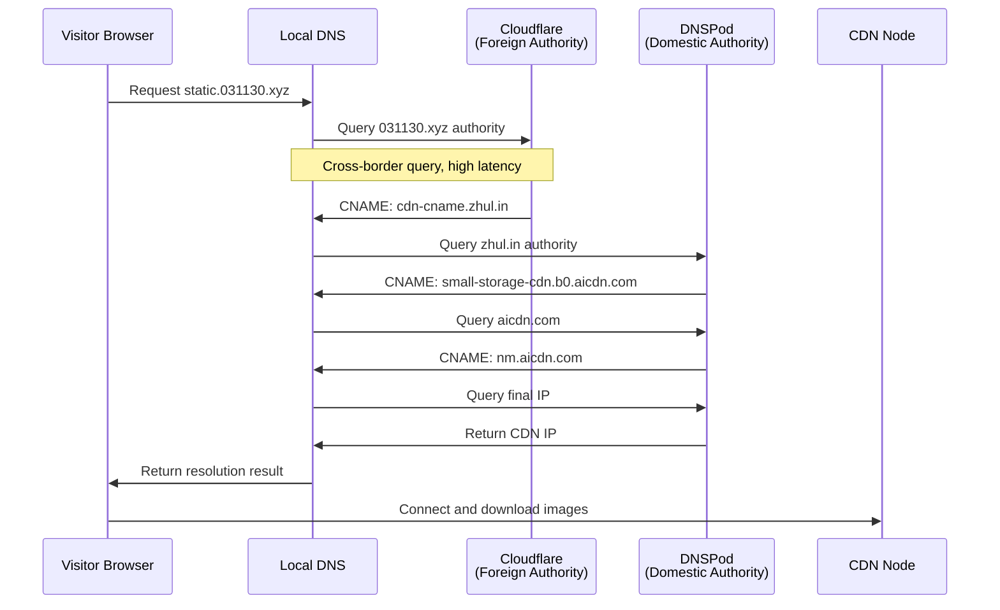
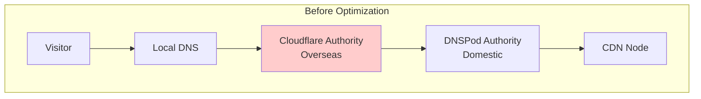
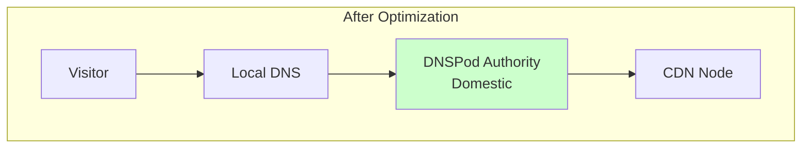
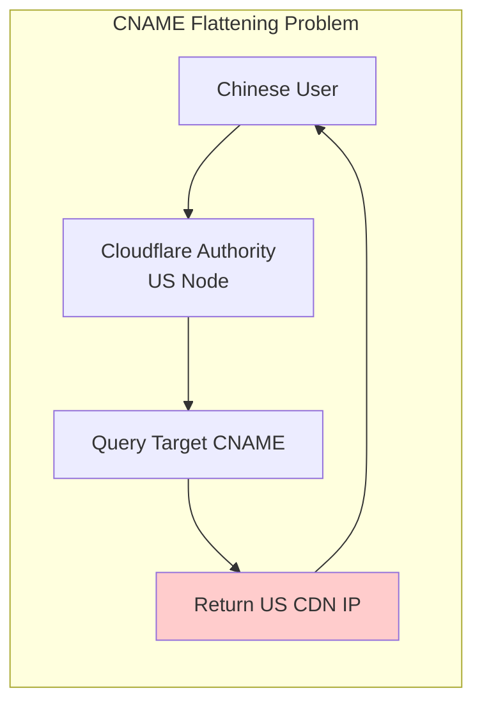

Last summer, I spent considerable time setting up an image hosting solution for my blog. The core goal was **geo-distributed DNS resolution** to ensure fast image loading for visitors both inside and outside China. The technical approach seemed perfect—until recently, when fellow bloggers reported slow image loading on first visits. That's when I discovered the real problem.


**955 milliseconds of DNS resolution time!** This number shocked me. After visitors opened my blog, they had to wait nearly a full second just to determine the image server location—completely negating the benefits of CDN optimization.

> **Context Note:** In China, there's a significant network divide between domestic and international internet access due to the Great Firewall. Many Chinese websites use geo-DNS to serve domestic users from servers within China and international users from overseas servers, optimizing for both speed and accessibility.

## Why Didn't I Notice Earlier?

The main culprit was **DNS caching**. It remembers resolution results for subsequent visits, making both my local tests and return visitor tests appear normal. It wasn't until users reported issues—combined with my recent review of DNS resolution flows for job interview prep (recursive queries, authoritative queries, root domains, TLDs, etc.)—that I pinpointed the problem: **first-visit DNS resolution latency**.

## DNS Resolution Flow Analysis

Let's examine what happens when a visitor accesses `static.031130.xyz`:



Here's the problem: **the first two query steps point to Cloudflare's authoritative servers overseas**. For domestic Chinese users, even though the final resolved CDN node is within China, the cross-border DNS queries are enough to cripple the first-visit experience. That 955ms latency is mostly spent communicating with foreign DNS servers.

> **Context Note:** DNSPod is Tencent's DNS service provider, widely used in China for its domestic infrastructure and reliability.

## Optimization Solutions

To address this issue, I implemented three measures:

### 1. DNS Prefetch

Added to the blog's HTML `<head>` section:

```html
<link rel="dns-prefetch" href="//static.031130.xyz">
```

This way, the browser performs DNS resolution for the image hosting domain while rendering the page. By the time images actually need to load, the DNS results may already be ready.

### 2. Extended TTL

Increased the TTL (Time To Live) value for the `static.031130.xyz` CNAME record from a few minutes to several hours or even a day. This allows local DNS servers to cache results longer, enabling subsequent users to directly use cached results and skip authoritative queries.

### 3. Migrate Authoritative DNS (Core Solution)

Migrated the **authoritative DNS servers** for the `031130.xyz` domain from Cloudflare to DNSPod in China:





Benefits after migration:
- When recursive DNS queries `031130.xyz`, it directly reaches DNSPod in China with fast response
- DNSPod directly returns `static.031130.xyz` -> `small-storage-cdn.b0.aicdn.com` without intermediate hops
- The entire DNS resolution chain completes domestically, dramatically reducing first-visit latency

## Optimization Results

While DNS caching makes testing difficult, after migrating the authoritative DNS + adjusting TTL + adding prefetch, first-visit DNS resolution time dropped to an acceptable range.

## Lessons Learned

1. **DNS Location Matters**: When optimizing for multiple regions, the geographic location of authoritative DNS servers significantly impacts first-visit latency. Prioritize using domestic authoritative servers for your target audience.

2. **First Visits Are Critical**: While caching helps subsequent visits, the first-visit experience directly affects user impression. Make good use of `dns-prefetch` and reasonable TTL settings.

3. **Monitoring and Feedback Are Important**: Local test environments often benefit from caching; real first-visit experiences need to be discovered through monitoring and user feedback.

## Important Warning: Beware of CNAME Flattening

If you need geo-distributed resolution to connect visitors to the nearest CDN node, **absolutely avoid CNAME Flattening**.

### What Is CNAME Flattening?

When an authoritative DNS server (like Cloudflare) sees a CNAME record, it proactively queries the final IP address of the target domain and then directly returns the IP instead of the CNAME.

### Why Does This Cause Problems?

Geo-distributed resolution (GeoDNS) is implemented at the authoritative DNS server level. When the authoritative server performs CNAME flattening, it queries the target domain's IP from its own location. If the authoritative DNS is in the US, it gets the optimal US node IP, then returns this IP to all regional queries, including Chinese users. This completely breaks your domestic CDN IP strategy configured for Chinese users.



### The Correct Approach

Honestly use CNAME to point to another domain that supports GeoDNS (such as `static.031130.xyz` -> `cdn-cname.zhul.in`, with the latter doing geo-distributed resolution on DNSPod). Only this way can you ensure the routing strategy executes correctly.

If you need geo-distributed resolution functionality, **do not** enable CNAME Flattening (or similar features like ALIAS, ANAME, etc.) on related domains.

---

> **Author's Note:** This article reflects the unique challenges of optimizing web services for the Chinese internet landscape, where the network infrastructure divide between domestic and international access requires careful DNS and CDN configuration to provide optimal performance for all users.
