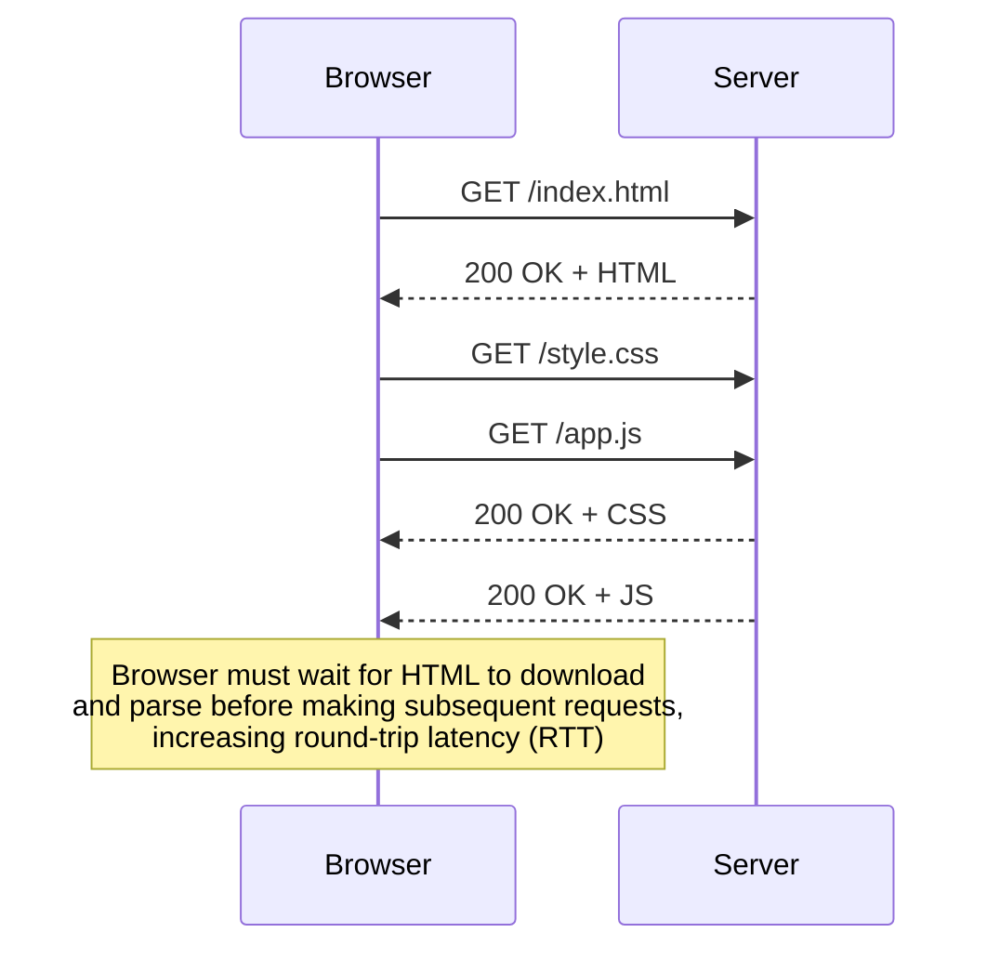
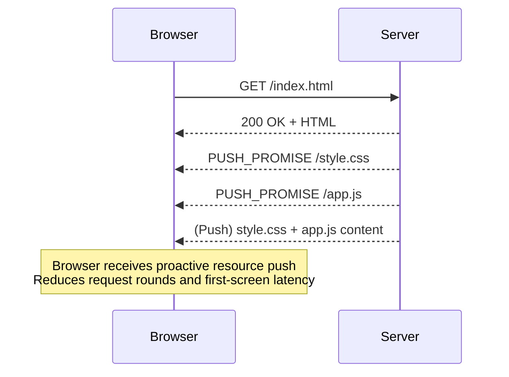
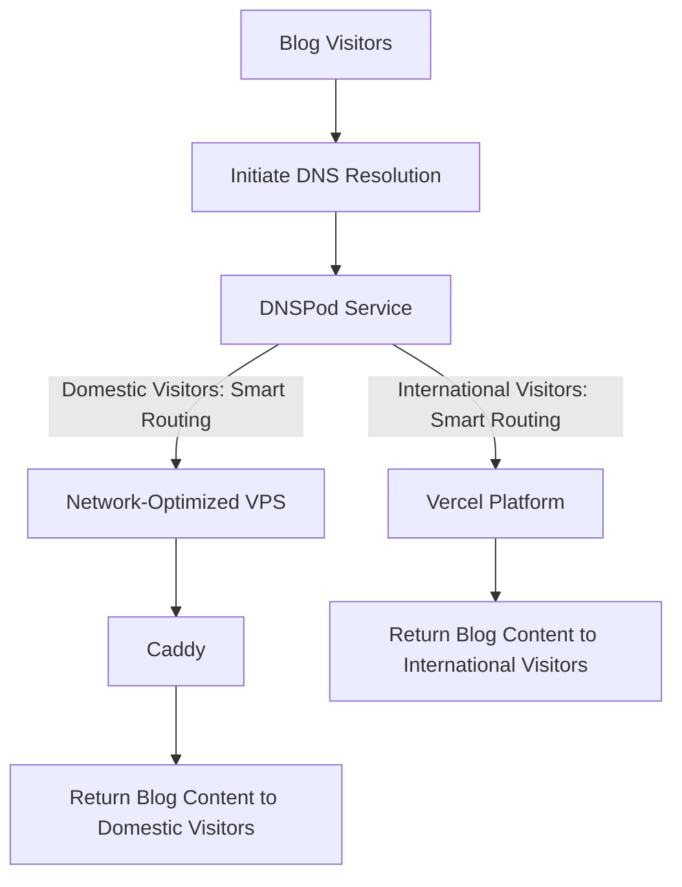

I've been refactoring my blog recently, and while preparing for autumn recruitment and memorizing technical concepts, I came across HTTP/2 server push. I then attempted to configure HTTP/2 server push for my blog during deployment to further optimize first-screen loading speed.

## Why HTTP/2 Server Push Could Improve First-Screen Loading Speed

As shown in the diagram below, in traditional HTTP/1.1, the browser first downloads `index.html` and completes the initial parsing, then retrieves the URLs for CSS/JS resources from the parsed data before making a second round of requests. After establishing TCP/TLS connections, it requires **at least two RTTs to retrieve** all the resources needed to fully render the page.

In HTTP/2's vision, the process would look like the diagram below. When the browser requests index.html, the server can simultaneously push CSS/JS resources to the client. This way, after establishing the TCP/TLS connection, it only needs **one RTT** to retrieve all resources needed for page rendering.

To minimize subsequent requests in HTTP/1.1, front-end developers have tried numerous optimization techniques. As Sukka mentioned in "[Static Resource Delivery Optimization: HTTP/2 and Server Push](https://blog.skk.moe/post/http2-server-push/)":

> The concepts of critical resources, critical rendering path, and critical request chain have existed for a long time. Asynchronous resource loading is old news: lazy-loading images, videos, iframes, and even lazy-loading CSS, JS, DOM, and lazy execution of functions. However, the approach to critical resource delivery hasn't changed much.

HTTP/2 Server Push created a new resource delivery paradigm. CSS/JS and other resources don't need to be delivered along with HTML to reach the client within one RTT, and these resources can be cached by the browser without being constrained by HTML's shorter TTL.

## Initial Solution

Having understood the advantages of HTTP/2 server push, I prepared to implement the optimization. My blog is purely static, using DNS for traffic splitting between domestic and international visitors: domestic traffic accesses a DMIT VPS with cmin2/9929 network optimization, served through Caddy; international traffic goes directly to Vercel, leveraging Amazon's CDN for global edge acceleration. The network architecture looks roughly like this:

Caddy can implement HTTP/2 server push through the `http.handlers.push` module. We can write simple push logic in the Caddyfile—no problem there. However, Vercel doesn't provide configuration options for HTTP/2 server push. Fortunately, since I have a static blog with low platform dependency, I considered migrating to Cloudflare Workers, [which developers implemented five years ago](https://brianli.com/cloudflare-workers-sites-http2-server-push/).

## Client Support Status

Historically, mainstream browser engines (Chrome/Chromium, Firefox, Edge, Safari) widely supported server push technology.

In November 2020, Google announced [plans to remove server push functionality from Chrome's HTTP/2 and gQUIC (which later evolved into HTTP/3) implementations](https://groups.google.com/a/chromium.org/g/blink-dev/c/K3rYLvmQUBY/m/vOWBKZGoAQAJ).

In October 2022, Google announced [plans to remove server push from Chrome](https://developer.chrome.com/blog/removing-push/), citing poor real-world performance, low adoption rates, and better alternatives. Chrome 106 became the first version to disable server push by default.

On October 29, 2024, Mozilla released Firefox 132, [removing support for HTTP/2 server push due to "compatibility issues with multiple websites."](https://www.firefox.com/en-US/firefox/132.0/releasenotes/)

With this, mainstream browser support for HTTP/2 Server Push has completely ended. From initially being viewed as an innovative feature to "reduce round-trip latency and optimize first-screen loading," to its eventual complete deprecation, HTTP/2 push's lifecycle lasted only a few short years, becoming an important experiment in web performance optimization history.

## Alternative Solutions

### 1. HTTP 103 Early Hints

103 Early Hints is the most direct "successor" to server push. It's an informational HTTP status code that allows the server to send an "early hint" response with Link headers before generating the complete HTML response (e.g., status code 200 OK).

This Link header can tell the browser: "Hey, I'm still preparing the main course (HTML), but you can start preparing the side dishes (CSS, JS) first." This way, the browser can utilize the server's "thinking time" to preemptively download critical resources or warm up connections to required origins, significantly reducing first-screen rendering time.

Compared to server push:

- Decision authority lies with the client: Early Hints are just "hints." The browser can decide whether to adopt them based on its own cache status, network conditions, and other factors. This solves server push's biggest pain point—servers cannot know about client caches, leading to redundant resource pushes.
- Better compatibility: It's a lighter mechanism that's easier for intermediary proxy servers to understand and relay.

103 Early Hints is very meaningful for dynamic blogs. Before backend computation, the 103 response can inform the browser about needed resources, allowing the browser to retrieve other resources first while waiting for the backend to return the final HTML. However, **for static blogs** like mine where **everything is pre-built**, it has **absolutely no meaning**. The gateway has enough time to send the 103 response that it could just directly send the HTML instead.

### 2. Resource Hints: Preload & Prefetch

Even before server push was deprecated, resource hints implemented through `<link>` tags were already common tools for front-end performance optimization. They declare resource loading hints in HTML, with the browser leading the entire process.

- `<link rel="preload">`: Tells the browser about resources that the current page will definitely use, requesting immediate high-priority loading without execution. For example, font files hidden deep in CSS or first-screen images dynamically loaded by JS. Through preload, you can ensure these critical resources are discovered and downloaded early, avoiding render blocking.
- `<link rel="prefetch">`: Tells the browser about pages or resources the user might access in the future, requesting low-priority background downloads during browser idle time. For example, prefetching article page resources that users are most likely to click on the article list page, achieving near-"instant" navigation experience.

Preload and Prefetch completely hand over resource loading control to developers and browsers. Through declarative methods, they allow fine-grained management of resource loading priority and timing. They are currently the most mature and widely applied resource preloading solutions, but still **cannot escape the curse of 2 RTTs**.

## Epilogue: An Elegy for an Idealist

In the end, I couldn't configure HTTP/2 server push for my blog.

**HTTP/2 Server Push has effectively "died." I miss it.**

In an ideal model, when the browser requests HTML, the server conveniently pushes the CSS and JS needed for rendering along with it, cleanly compressing what would originally be at least two round trips (RTT) into one. This is such a direct, such an elegant solution—almost the "silver bullet" that front-end engineers dream of when facing first-screen rendering latency issues. Behind it lies an ambitious spirit: attempting to thoroughly solve the "critical request chain" latency problem from the server side, once and for all.

But the Web world is ultimately not an ideal laboratory. It's full of caches, returning users, and all kinds of network environments.

The greatest charm of server push lies in its "proactivity," and its greatest regret also stems precisely from this "proactivity." It cannot know whether the browser's cache already quietly holds that style.css file it's preparing to enthusiastically push. For the sake of the ultimate experience for a small portion of first-time visitors, it might waste precious bandwidth for more returning users.

The Web's evolution ultimately chose a more prudent path with a more collaborative spirit. It returned decision-making authority to the browser, which knows the situation best. The entire interaction changed from the server's "**I push to you**" to the server's "**I suggest you fetch**," with the browser making its own judgment. This may not be romantic enough, not extreme enough, but it's more universal and more robust.

So, I still miss that ambitious Server Push. It represented a pure pursuit of ultimate performance, a beautiful technical idealism. Although it has quietly faded from the historical stage, the dream about "speed" it pointed toward has long been inherited by 103 Early Hints and preload in a more mature, more balanced way.

## See Also

- [Remove HTTP/2 Server Push from Chrome  |  Blog  |  Chrome for Developers](https://developer.chrome.com/blog/removing-push)
- [HTTP/2 Server Push - Wikipedia](https://en.wikipedia.org/wiki/HTTP/2_Server_Push)
- [静态资源递送优化：HTTP/2 和 Server Push | Sukka's Blog](https://blog.skk.moe/post/http2-server-push/)
- [Module http.handlers.push - Caddy Documentation](https://caddyserver.com/docs/modules/http.handlers.push)
- [How to Configure HTTP/2 Server Push on Cloudflare Workers Sites](https://brianli.com/cloudflare-workers-sites-http2-server-push/)
- [Intent to Remove: HTTP/2 and gQUIC server push](https://groups.google.com/a/chromium.org/g/blink-dev/c/K3rYLvmQUBY/m/vOWBKZGoAQAJ)