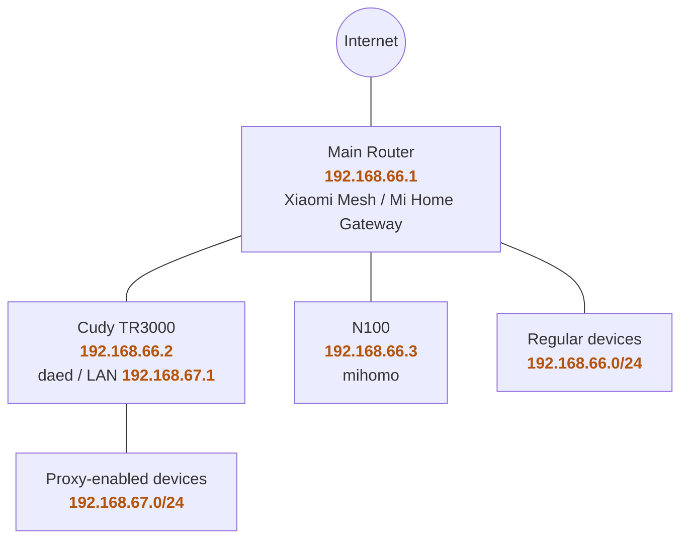
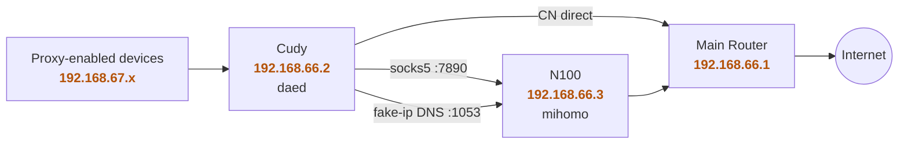

## Background

Let me start with a quick note: in the rest of this post, "dae," "daed," and "mihomo" refer to the familiar transparent proxy stack you already know.

I previously documented my experience [running daed on the Cudy TR3000](/en/2025/02/28/cudy-tr3000-daed-install-record/). Back in my internship apartment, the broadband was only 200 Mbps—I ran some tests and found that proxy throughput could saturate the connection, and the CPU seemed to hold up just fine. At the time, I was convinced that this little router could single-handedly handle the transparent proxy duties.

After I left the job and returned home, the bandwidth got significantly thicker. That's when Cudy started to show its cracks: direct connections would max out the speed, but as soon as traffic went through the proxy, performance took a noticeable hit. The NICs are respectable enough, but when it comes to the actual heavy lifting—encryption, decryption, and rule matching—that tiny SoC just can't keep up.

Memory is another pain point. The Cudy only has 512 MB of RAM, and when connecting to high-latency nodes in the US West Coast, the TCP window scales with RTT, consuming buffer memory aggressively. With the same protocol, low-latency Asia-Pacific nodes can saturate the bandwidth much more easily, while US West Coast nodes just can't reach the same throughput. At first I thought it was a node quality issue, but it turned out the little router was the bottleneck all along.

I also didn't want to touch the main router. At home, the Xiaomi stock firmware is still responsible for the Mesh network, and the Mi Home smart home gateway also depends on it. Messing up the proxy is one thing, but if light bulbs, power outlets, and the robot vacuum all go offline at once—that's a nightmare. So the main router continues to handle PPPoE, Wi-Fi, DHCP, Mesh, and Mi Home duties. No proxy experiments on it.

Of course, I initially considered an all-in-one solution—just plug in a small box and be done with it. Elegant, right? Unfortunately, in a home network, all-in-one is often just one careless update away from all-in-boom. So I ended up with a semi-split architecture: both the Cudy and an N100 box sit under the main router. Cudy runs daed as the transparent proxy entry point, first using geosite/geoip to send CN traffic directly out through the main router. Everything else goes to mihomo on the N100, with DNS also handled by its fake-IP mode.

## Network Topology

The IPs below are for illustration only—don't map them directly to your actual home subnet.

Physical connections:



Traffic flow:



CN traffic goes directly out through the main router at the daed layer. All other traffic that should be proxied—along with fake-ip DNS queries—is forwarded to the N100. Notably, the `198.18.0.0/16` fake-IP range must also go through the SOCKS5 proxy, so it doesn't get mistakenly caught by CN / private direct-routing rules.

## Mihomo Side

The N100 exposes two things for Cudy to use: a SOCKS port via `mixed-port`, and a fake-IP DNS server. Why fake-IP over real-IP? Sukka's post [*Let's Talk About DNS Leakage, CDN Optimization, and Fake IP*](https://blog.skk.moe/post/lets-talk-about-dns-cdn-fake-ip/) explains it well—I won't repeat it all here. In short, it offers faster response times and avoids CDN scheduling pitfalls. Here's a stripped-down version of the config:

```yaml
mixed-port: 7890
allow-lan: true
mode: rule
log-level: info
unified-delay: true

dns:
  enable: true
  enhanced-mode: fake-ip
  listen: 0.0.0.0:1053
  default-nameserver:
    - 223.5.5.5
  nameserver:
    - https://doh.pub/dns-query
    - https://dns.alidns.com/dns-query
  direct-nameserver:
    - 192.168.66.1
    - 119.29.29.29

proxy-providers:
  sub:
    type: http
    url: "https://example.com/sub/xxxxxxxx"
    interval: 21600
    path: ./providers/sub.yaml
    health-check:
      enable: true
      interval: 600
      url: http://www.gstatic.com/generate_204

rule-providers:
  lan:
    type: http
    behavior: classical
    format: text
    url: https://cdn.jsdelivr.net/gh/ACL4SSR/ACL4SSR@master/Clash/LocalAreaNetwork.list
    path: ./rules/lan.yaml
    interval: 86400
  proxylite:
    type: http
    behavior: classical
    format: text
    url: https://cdn.jsdelivr.net/gh/ACL4SSR/ACL4SSR@master/Clash/ProxyLite.list
    path: ./rules/proxylite.yaml
    interval: 86400
  chinadomain:
    type: http
    behavior: classical
    format: text
    url: https://cdn.jsdelivr.net/gh/ACL4SSR/ACL4SSR@master/Clash/ChinaDomain.list
    path: ./rules/chinadomain.yaml
    interval: 86400

proxy-groups:
  - name: 🚀 节点选择
    type: select
    proxies:
      - ⚡ 最低延迟
      - DIRECT
    use:
      - sub

  - name: ⚡ 最低延迟
    type: url-test
    url: http://www.gstatic.com/generate_204
    interval: 180
    tolerance: 50
    use: [sub]

  - name: 🎯 全球直连
    type: select
    proxies:
      - DIRECT

  - name: 🐟 漏网之鱼
    type: select
    proxies:
      - 🚀 节点选择
      - 🎯 全球直连

rules:
  - RULE-SET,lan,🎯 全球直连
  - RULE-SET,proxylite,🚀 节点选择
  - RULE-SET,chinadomain,🎯 全球直连
  - GEOIP,LAN,🎯 全球直连
  - GEOIP,CN,🎯 全球直连
  - MATCH,🐟 漏网之鱼
```

Keep `allow-lan` enabled, and have DNS listen on `0.0.0.0:1053`. For direct-domain resolution, you can either forward queries to the main router's DNS (shown as `192.168.66.1`), leave it unset, or use public DNS providers like Alibaba or Tencent—either works fine. The actual rule sets and proxy groups in my setup are more extensive, but what's shown above is the core skeleton.

## Daed Side

On the Cudy, I'm using the daed web UI. The SOCKS proxy points to `192.168.66.3:7890`, DNS points to `192.168.66.3:1053`, and it's best to assign the N100 a fixed IP address.


DNS rules: CN traffic uses normal resolution, everything else goes to mihomo for fake-IP responses.

```ini
upstream {
  mainrouter: 'udp://192.168.66.1:53'
  mihomo: 'udp://192.168.66.3:1053'
}

routing {
  request {
    qname(geosite:cn) -> mainrouter
    fallback: mihomo
  }
}
```

The routing rules are as follows—the key point is to forcibly send the fake-IP range to mihomo:

```ini
routing {
    pname(NetworkManager, systemd-resolved, dnsmasq) -> must_direct

    dip(198.18.0.1/16) -> proxy

    dip(192.168.66.1/24) -> direct
    dip(geoip:private) -> direct
    dip(geoip:cn) -> direct
    domain(geosite:cn) -> direct
    fallback: proxy
}
```

Make sure `dip(198.18.0.1/16) -> proxy` comes before `domain(geosite:cn) -> direct` and `dip(geoip:private) -> direct`. The fake-IP addresses returned by mihomo all fall within this range, and clients subsequently connect to these synthetic IPs. **If you don't force this routing, daed may treat the traffic as direct and attempt to reach a non-existent `198.18.x.x` address.**

Whether this semi-split setup is right for you depends on your home bandwidth and node locations. In that 200 Mbps apartment, Cudy could handle the entire proxy workload on its own. But once bandwidth increases and US West Coast nodes enter the picture, it's time to delegate the heavy lifting. The main router stays focused on Mi Home duties, Cudy acts as a gatekeeper for traffic classification, and the N100 takes on the real work—at least now, this little mini-router no longer has to carry the entire proxy load by itself.

Lastly, my apologies: I've used quite a few code names throughout this post to help keep the blog accessible in certain regions. If that makes the reading a bit jarring at times, I appreciate your understanding.

## References

- [Cudy TR3000 daed Installation Guide](/en/2025/02/28/cudy-tr3000-daed-install-record/)
- [What, Why, and How — Let's Talk About DNS Leakage, CDN Optimization, and Fake IP | Sukka's Blog](https://blog.skk.moe/post/lets-talk-about-dns-cdn-fake-ip/)
- [daeuniverse/dae: eBPF-based Linux high-performance transparent proxy solution.](https://github.com/daeuniverse/dae)
