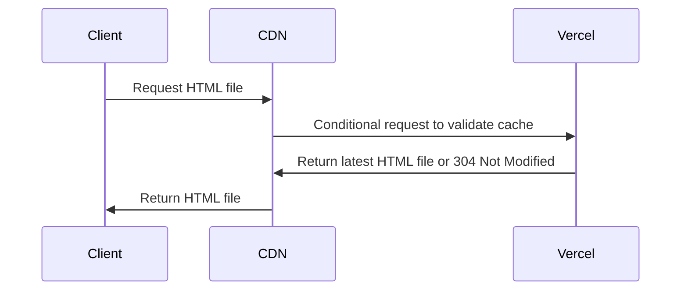
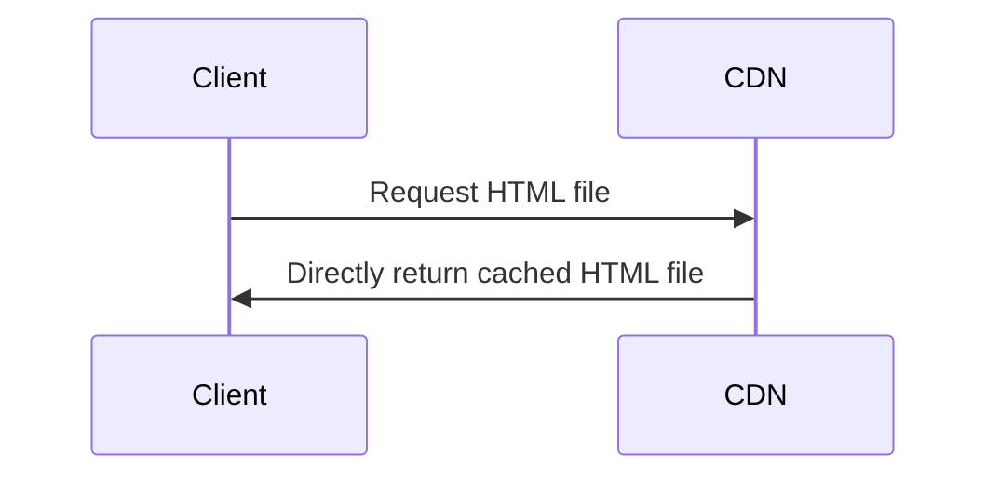

Vercel's default cache configuration is actually not very reasonable, but few people notice it.

## First, Let's Look at the Results


## Analysis

### Testing Approach

Both images show test results from my blog on [PageSpeed Insights](https://pagespeed.web.dev/). The testing steps were:

1. Deploy
2. Run the first test on PageSpeed Insights
3. Wait 120 seconds to prevent PageSpeed Insights from using cached results
4. Run the second test and use those results

**The purpose of using the second test results** is to ensure that the Vercel CDN node accessed by PageSpeed Insights has completed fetching from origin and **cached the content on the CDN node**. This way, the second access retrieves results directly from the CDN cache without needing to fetch from origin.

Looking at the test results in Figure 1, does it seem normal? The loading time for a single HTML page reached **450ms. While this doesn't look terribly slow, there's actually a problem when you examine it closely.**

Vercel uses Amazon's global CDN network. After our first visit, the CDN node should have already cached the homepage content, so the second visit should retrieve content directly from the CDN node's cache.

### What Would Be a Reasonable Duration?

- TCP connection establishment requires 1.5 round-trip times (RTT) for the three-way handshake, plus 1 RTT for TLS 1.3 handshake, totaling 2.5 RTT.
- The HTML file size is 18KB. The initial congestion window (IW) of 10 MSS ≈ 1460 bytes ≈ 14.6KB means it should theoretically be transmitted within two RTTs.

Total: 4.5 RTT.

PageSpeed Insights likely uses a node in the United States for testing. Amazon CDN has extensive coverage in the US, so keeping a single RTT under 5ms is more than adequate. Therefore, the theoretical loading time should be around 22.5ms. Adding DNS resolution time (which shouldn't be much since there was an access two minutes prior, so this isn't a cold start) and some uncontrollable network jitter, **it should be completely fine to stay within 50ms.**

**But the actual measured time was 450ms, nearly 9 times higher—this is very unreasonable.**

Now let's look at Figure 2's results. The single HTML loading time dropped to 41ms, which completely meets expectations.

Why is there such a huge difference? The reason lies in Vercel's cache control settings.

## Vercel's Cache Control

For websites deployed on Vercel, by default, Vercel sets the following cache control header for HTML files:

```
cache-control: public, max-age=0, must-revalidate
```

This setting means:
- `public`: The response can be cached by any cache, including browsers and CDNs.
- `max-age=0`: The maximum cache time for the response is 0 seconds, meaning the response expires immediately after being cached.
- `must-revalidate`: Once the response expires, the cache must validate its validity with the origin server.

Combined, these three directives mean Vercel is essentially telling CDN nodes: you can cache this HTML file, but you must validate its validity with the origin server before using the cache each time. Since `max-age=0`, the cache expires immediately upon storage, so every request triggers origin validation.

Although cache validation in HTTP/1.1 and HTTP/2 typically uses conditional requests (such as the file's ETag or Last-Modified headers) to save transmission bandwidth, this still requires round-trip communication with the origin server, adding extra latency overhead.

Therefore, under Vercel's default configuration, responses to any request won't be directly cached by CDN nodes. The general flow is as follows:



## Solution

To solve this problem, we need to adjust Vercel's cache control settings so that HTML files can be cached by CDN nodes for a period of time without needing origin validation every time.

Vercel allows us to create a `vercel.json` file in the project's root directory to configure various aspects of Vercel's deployment behavior, including HTTP response header configuration.

My blog is built with the Nuxt.js framework, and the generated build artifacts roughly fall into two categories:

1. HTML files: These files' content may change frequently and shouldn't have excessively long cache times;
2. Static resource files: Including JavaScript, CSS, etc. These files typically have hash values in their filenames and can have longer cache times or even be marked as immutable.

In terms of deployment workflow, my blog is first built into static pages in GitHub Actions after each push, then deployed to Vercel. So I created a `vercel.json` file in my project's public directory (this way the vercel.json file will be in the root of the build artifacts) with the following content:

```json
{
  "headers": [
    {
      "source": "/(.*)",
      "headers": [
        {
          "key": "Cache-Control",
          "value": "public, max-age=0, s-maxage=600, must-revalidate"
        }
      ]
    },
    {
      "source": "/(.*)\\.(css|js)",
      "headers": [
        {
          "key": "Cache-Control",
          "value": "public, max-age=31536000, immutable"
        }
      ]
    }
  ]
}
```

Here I set `max-age=31536000, immutable` for all CSS and JS files, so these static resource files can be cached long-term by browsers and CDNs. For all other files (mainly HTML files), I set `max-age=0, s-maxage=600, must-revalidate`, so HTML files can be cached by the CDN for 10 minutes. Requests within these 10 minutes can retrieve content directly from the CDN node's cache without needing origin validation.

With this modified cache control setting, the request flow for HTML files becomes:



This greatly reduces request latency and improves page loading speed.

## Other Considerations

Vercel's architecture isn't the traditional "origin server - CDN" architecture, but rather closer to a "global multi-region storage + CDN edge cache" architecture. So even for origin requests, Vercel will try to retrieve content from the storage node closest to the user to reduce latency. However, this doesn't mean origin request latency can be ignored, especially when pursuing optimal loading speed—proper cache control remains very important.

## References

- [Cache-Control headers | Vercel](https://vercel.com/docs/headers/cache-control-headers)
- [Vercel CDN Cache | Vercel](https://vercel.com/docs/cdn-cache)
- [HTTP caching - HTTP | MDN](https://developer.mozilla.org/en-US/docs/Web/HTTP/Guides/Caching)
