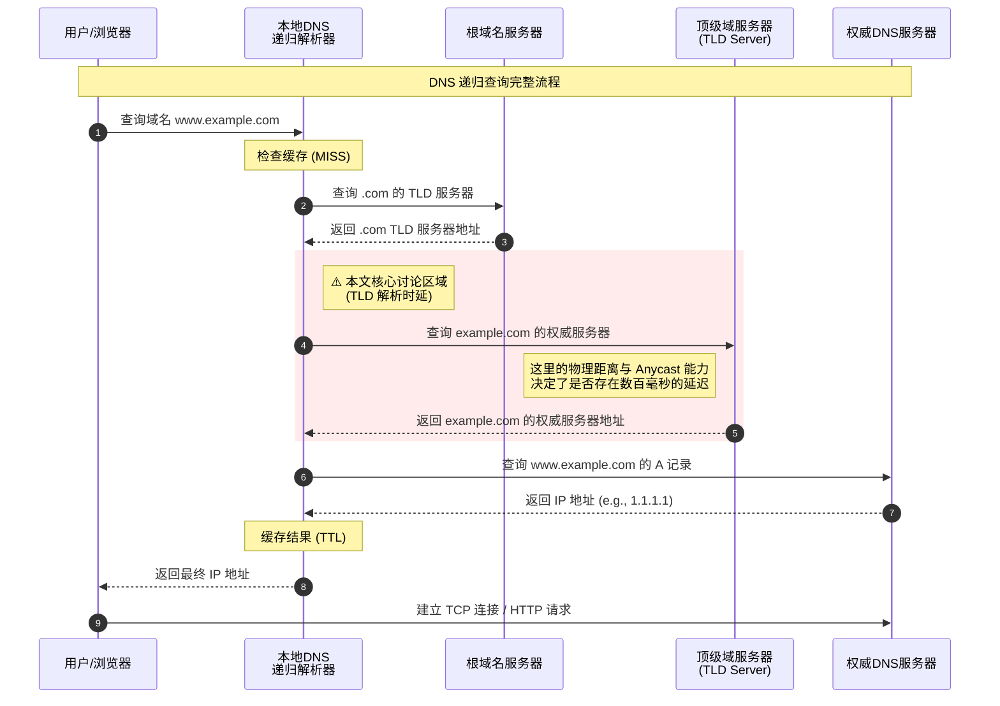

在[上一篇博客](/2025/11/11/dns-cold-start-dilemma/)中，我提到过一个核心观点——**对于流量少、访客的地理位置不集中的小型站点，DNS 冷启动不是偶发的“意外”，而是一种被动的“常态”。**

对于大多数站长而言，自己的站点流量不是一时半刻就能提上去的，因此我们的访客大概率都要走完一遍完整的 DNS 解析过程。上一篇博客中我提到过更改为距离访客物理位置更近的权威 DNS 服务器来提升速度，但 **TLD（域名后缀）的 Nameservers 是我们无法改变的**，也就是下图中红色背景的那一段解析过程。



所以，如果你还没有购买域名，但想要像个 geeker 一样追求极致的首屏加载（哪怕你并没有多少访客），你该选择哪个 TLD 呢？

## 简单测试

一个简单的方法是，直接去 ping TLD 的 nameserver，看看访客所请求的公共 DNS 服务器在这一段解析中所花费的时常。

以我的域名 zhul.in 为例，在 Linux 下，可以通过 `dig` 命令拿到 `in` 这个 TLD 的 Nameserver

```bash
dig NS in.
```


随后可以挑选任何一个 Nameserver（公共 DNS 服务器其实有一套基于历史性能的选择策略），直接去 ping 这个域名


我这里的网络环境是杭州移动，如果我在我的局域网开一台 DNS 递归服务器，这个结果就是在上面那张时序图中红色部分所需要时长的最小值（DNS 服务器还需要额外的时长去处理请求）。

借助一些网站提供的多个地点 ping 延迟测试，我们可以推测这个 TLD 在全球哪些国家或地区部署了 Anycast（泛播）节点，下图为 iplark.com 提供的结果。


可以推测，in 的 TLD Nameserver 起码在日本、香港、美国、加拿大、欧洲、澳大利亚、巴西、印度、南非等多地部署了 Anycast 节点，而在中国大陆境内的延迟较高。

***

作为对比，我们可以通过同样的方法再看看 cn 域名的 TLD Nameserver 的 Anycast 节点。


经过 itdog.cn 的测试，推测 cn 域名的 TLD Nameserver 可能仅在北京有节点。

## 更进一步的的实验方案

上面的测试方法只是一个简易的判断方法，在现实中会有很多的外部因素影响 DNS 冷启动的解析时长：

- 公共 DNS 服务器和 TLD Nameserver 之间存在 peer，他们的通信非常快
- TLD Nameserver 的性能差，需要额外的几十 ms 去处理你的请求
- TLD 的几个 Nameserver 有快慢之分，而你选用的公共 DNS 服务器能根据历史数据选择较快的那个
- ...

所以，我们需要有一个基于真实的 DNS 解析请求的测试方案

对于 DNS 冷启动相关的测试一直以来存在一个困境——公共 DNS 服务器不归我们管，我们无法登陆上去手动清除它的缓存，因此所有的测试都只有第一次结果才可能有效，后续的请求会直接打到缓存上。但这一次我们测试的是公共 DNS 服务器到 TLD Nameserver 这一段的延迟，在 Gemini 的提醒下，我意识到可以在不同地区测试公共 DNS 对随机的、不存在的域名的解析时长，这能够反应不同 TLD 之间的差异。

所以，测试代码在下面，你可以使用常见的 Linux 使用 bash 执行这段代码，需要确保装有 dig 和 shasum 命令，并且推荐使用 screen / tmux 等工具挂在后台，因为整个测试过程可能会持续十几分钟。如果你所采用的网络环境在中国大陆境内，我建议你把代码中的公共 DNS 服务器换成 223.5.5.5 / 119.29.29.29 ，应该会更符合境内访客的使用环境。

```bash
#!/bin/bash

# ================= 配置区域 =================
# CSV 文件名
OUTPUT_FILE="dns_benchmark_results.csv"

# DNS 服务器
DNS_SERVER="8.8.8.8"

# 待测试的 TLD 列表
# 包含：全球通用(com), 国别(cn, de), 热门技术(io, xyz), 以及可能较慢的后缀
TLDS_TO_TEST=("com" "net" "org" "cn" "in" "de" "cc" "site" "ai" "io" "xyz" "top")

# 每个 TLD 测试次数
SAMPLES=1000

# 每次查询间隔 (秒)，防止被 DNS 服务器判定为攻击
# 1000次 * 0.1s = 100秒/TLD，总耗时约 15-20 分钟
SLEEP_INTERVAL=0.1
# ===========================================

# 初始化 CSV 文件头
echo "TLD,Domain,QueryTime_ms,Status,Timestamp" > "$OUTPUT_FILE"

echo "============================================="
echo "   DNS TLD Latency Benchmark Tool"
echo "   Target DNS: $DNS_SERVER"
echo "   Samples per TLD: $SAMPLES"
echo "   Output File: $OUTPUT_FILE"
echo "============================================="
echo ""

# 定义进度条函数
function show_progress {
    # 参数: $1=当前进度, $2=总数, $3=当前TLD, $4=当前平均耗时
    let _progress=(${1}*100/${2})
    let _done=(${_progress}*4)/10
    let _left=40-$_done

    # 构建填充字符串
    _fill=$(printf "%${_done}s")
    _empty=$(printf "%${_left}s")

    # \r 让光标回到行首，实现刷新效果
    printf "\rProgress [${_fill// /#}${_empty// /-}] ${_progress}%% - Testing .${3} (Avg: ${4}ms) "
}

# 主循环
for tld in "${TLDS_TO_TEST[@]}"; do
    # 统计变量初始化
    total_time_accum=0
    valid_count=0

    for (( i=1; i<=${SAMPLES}; i++ )); do
        # 1. 生成随机域名 (防止缓存命中)
        # 使用 date +%N (纳秒) 确保足够随机，兼容 Linux/macOS
        RAND_PART=$(date +%s%N | shasum | head -c 10)
        DOMAIN="test-${RAND_PART}.${tld}"
        TIMESTAMP=$(date "+%Y-%m-%d %H:%M:%S")

        # 2. 执行查询
        # +tries=1 +time=2: 尝试1次，超时2秒，避免脚本卡死
        result=$(dig @${DNS_SERVER} ${DOMAIN} A +noall +stats +time=2 +tries=1)

        # 提取时间 (Query time: 12 msec)
        query_time=$(echo "$result" | grep "Query time" | awk '{print $4}')
        # 提取状态 (status: NXDOMAIN, NOERROR, etc.)
        status=$(echo "$result" | grep "status:" | awk '{print $6}' | tr -d ',')

        # 3. 数据清洗与记录
        if [[ -n "$query_time" && "$query_time" =~ ^[0-9]+$ ]]; then
            # 写入 CSV
            echo "${tld},${DOMAIN},${query_time},${status},${TIMESTAMP}" >> "$OUTPUT_FILE"

            # 更新统计
            total_time_accum=$((total_time_accum + query_time))
            valid_count=$((valid_count + 1))
            current_avg=$((total_time_accum / valid_count))
        else
            # 记录失败/超时
            echo "${tld},${DOMAIN},-1,TIMEOUT,${TIMESTAMP}" >> "$OUTPUT_FILE"
            current_avg="N/A"
        fi

        # 4. 显示进度条
        show_progress $i $SAMPLES $tld $current_avg

        sleep $SLEEP_INTERVAL
    done

    # 每个 TLD 完成后换行
    echo ""
    echo "✅ Completed .${tld} | Final Avg: ${current_avg} ms"
    echo "---------------------------------------------"
done

echo "🎉 All Done! Results saved to $OUTPUT_FILE"
```

## 测试结果

**免责声明：以下测试结果仅供参考，不构成任何购买推荐，且仅代表测试当日（2025.11.24）的网络情况，后续不会进行跟进。DNS 冷启动对于大型站点几乎没有影响，仅小站需要关注。本次测试中，所有境内检测点使用 223.5.5.5 作为 DNS 服务器，境外检测点使用 8.8.8.8。**

| 测试点/延迟（ms）     | .com | .net | .org | .cn  | .in  | .de  | .cc  | .site | .ai  | .io  | .xyz | .top |
| --------------------- | ---- | ---- | ---- | ---- | ---- | ---- | ---- | ----- | ---- | ---- | ---- | ---- |
| 🇨🇳 上海腾讯云          | 438  | 429  | 470  | 30   | 535  | 353  | 476  | 454   | 367  | 485  | 444  | 43   |
| 🇨🇳 北京腾讯云          | 425  | 443  | 469  | 17   | 350  | 420  | 466  | 647   | 582  | 461  | 559  | 9    |
| 🇭🇰 香港 Yxvm           | 75   | 75   | 363  | 227  | 6    | 11   | 61   | 6     | 33   | 126  | 5    | 7    |
| 🇨🇳 彰化(台湾) Hinet    | 90   | 87   | 128  | 213  | 59   | 38   | 76   | 37    | 73   | 94   | 36   | 47   |
| 🇯🇵 大阪 Vmiss          | 20   | 19   | 244  | 309  | 15   | 24   | 17   | 35    | 19   | 65   | 37   | 90   |
| 🇸🇬 新加坡 Wap          | 6    | 9    | 139  | 398  | 6    | 10   | 7    | 17    | 7    | 110  | 17   | 66   |
| 🇺🇸 洛杉矶 ColoCrossing | 7    | 7    | 307  | 137  | 4    | 64   | 5    | 62    | 5    | 49   | 47   | 231  |
| 🇩🇪 杜塞尔多夫 WIIT AG  | 16   | 17   | 288  | 82   | 75   | 15   | 14   | 24    | 66   | 73   | 24   | 306  |
| 🇦🇺 悉尼 Oracle         | 33   | 31   | 12   | 338  | 7    | 13   | 121  | 7     | 10   | 9    | 7    | 191  |

通过上面的数据，我们可以看到 .cn 和 .top 是所有测试的域名后缀中在中国大陆境内解析速度最快的，但选择 .cn 和 .top 意味着你需要牺牲其他地区访客的解析速度。而像 .com、.net、.org 这些通用的域名后缀在全球绝大部分地区表现良好，而在中国大陆境内的解析速度则相对较慢，因为他们没有在大陆境内部署 Anycast 节点。

**经 v2ex 的网友 [Showfom](https://www.v2ex.com/member/Showfom) 提醒，GoDaddy 作为注册局掌握的部分 TLD 的 Nameserver 同样在中国大路境内拥有 Anycast 节点，比如 .one、.tv、.moe 等。另， Amazon Registry Services 旗下的 .you 域名经我测试也有境内的 Anycast 节点。其他域名后缀可自行测试。**

你可以点击[这里](https://static.031130.xyz/bin/dns_benchmark_results_20251124.tar.zst)下载完整的测试结果 CSV 文件进行进一步的分析。
