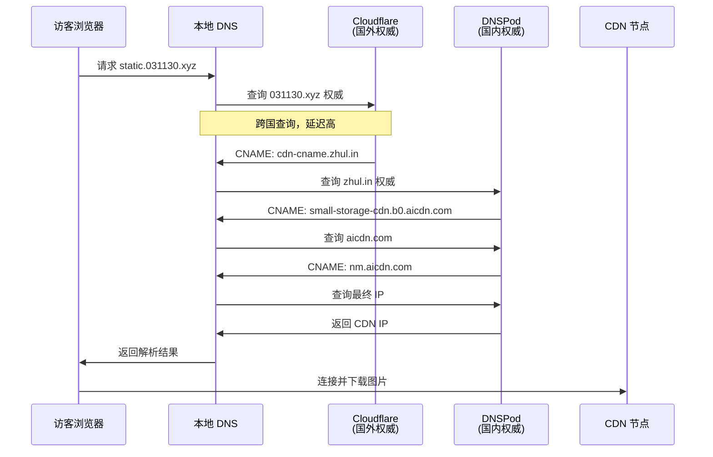
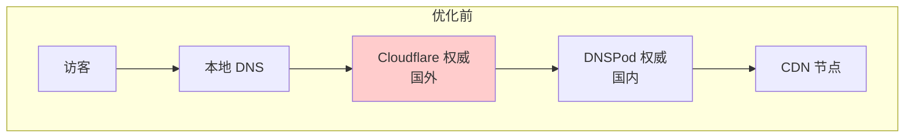
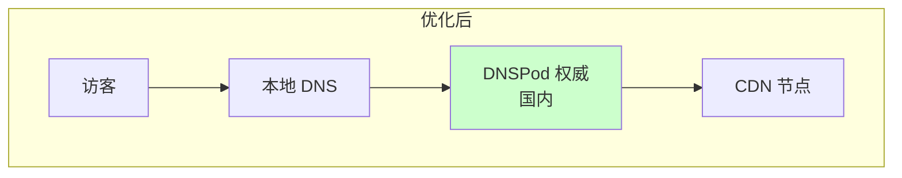
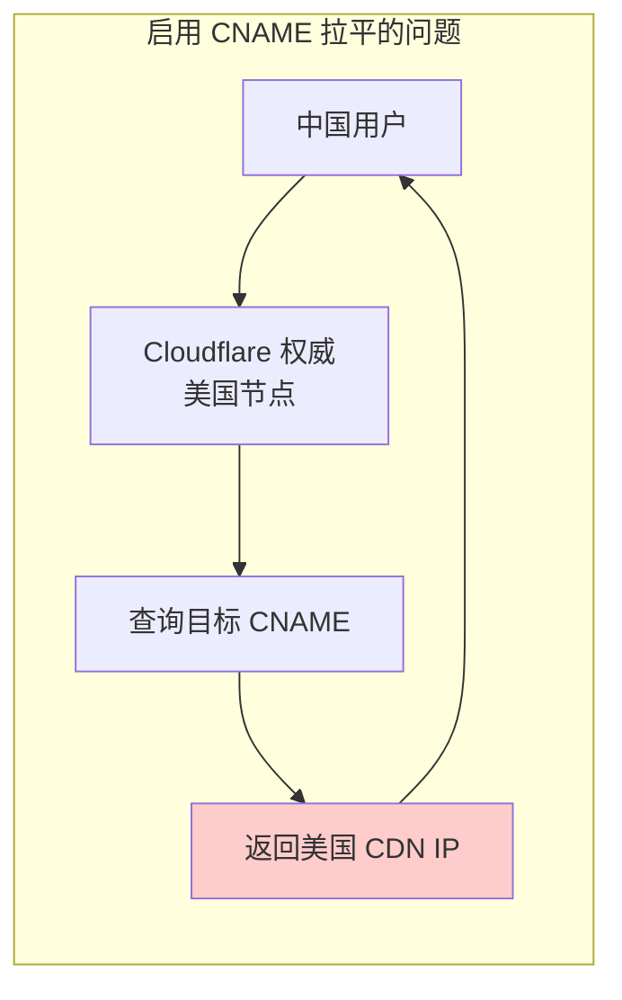

去年夏天，我花了不少时间搭建博客图床，核心目标是**分地区解析 DNS**，让国内外访客都能快速加载图片。技术方案看起来完美无缺，直到最近群友反馈首次访问时图片加载很慢，我才发现问题所在。


**955 毫秒的 DNS 解析时长！** 这个数字让我大吃一惊。访客点开博客后，光是确定图片服务器位置就要等将近一秒，这完全抵消了 CDN 优化的效果。

## 为什么之前没发现？

主要是 **DNS 缓存**的"功劳"。它会为后续访问记住解析结果，让我的本地测试和复访测试看起来都很正常。直到用户反馈，结合最近准备秋招复习的 DNS 解析流程（递归查询、权威查询、根域名、顶级域名等），我才定位到问题：**首次访问时的 DNS 解析延迟**。

## DNS 解析流程分析

让我们看看访客访问 `static.031130.xyz` 时，DNS 是如何工作的：



问题就在这里：**前两步查询指向了国外的 Cloudflare 权威服务器**。对于国内用户，虽然最终解析到的 CDN 节点是国内的，但跨国 DNS 查询就足以拖垮首次访问体验。那 955ms 的延迟，基本都耗在与国外 DNS 服务器的通信上了。

## 优化方案

针对这个问题，我采取了三个措施：

### 1. DNS 预取

在博客 HTML 的 `<head>` 中添加：

```html
<link rel="dns-prefetch" href="//static.031130.xyz">
```

这样浏览器在渲染页面时就会提前解析图床域名，等真正需要加载图片时，DNS 结果可能已经准备好了。

### 2. 延长 TTL

将 `static.031130.xyz` 的 CNAME 记录 TTL 值调大（从几分钟延长到几小时甚至一天）。这样本地 DNS 服务器会缓存更久，后续用户可以直接使用缓存结果，省掉权威查询。

### 3. 迁移权威 DNS（核心）

将 `031130.xyz` 域名的**权威 DNS 服务器**从 Cloudflare 迁移到国内的 DNSPod：





迁移后的好处：
- 递归 DNS 查询 `031130.xyz` 时，直接找到国内的 DNSPod，响应快
- DNSPod 直接返回 `static.031130.xyz` -> `small-storage-cdn.b0.aicdn.com`，无需中间跳转
- 整个 DNS 解析链路在国内完成，首次访问延迟大幅降低

## 优化效果

虽然 DNS 缓存给测试带来了困难，但迁移权威 DNS + 调整 TTL + 添加预取后，首次访问的 DNS 解析时间降到了可接受的范围。

## 经验教训

1. **DNS 位置很重要**：涉及多地优化时，权威 DNS 的地理位置对首次访问延迟影响很大。优先使用国内权威服务器。

2. **首次访问是关键**：虽然缓存能帮助后续访问，但首次访问体验直接影响用户印象。善用 `dns-prefetch` 和合理的 TTL 设置。

3. **监控和反馈重要**：本地测试环境往往有缓存加持，真实的首次访问体验需要通过监控和用户反馈来发现。

## 重要提醒：警惕 CNAME 拉平

如果你需要分地区解析来让访客连接到最近的 CDN 节点，**务必避开 CNAME Flattening（CNAME 拉平）**。

### 什么是 CNAME 拉平？

权威 DNS 服务器（如 Cloudflare）看到 CNAME 记录后，会主动查询目标域名的最终 IP 地址，然后直接返回 IP 而不是 CNAME。

### 为什么会出问题？

分地区解析（GeoDNS）在权威 DNS 服务器层面实现。当权威服务器执行 CNAME 拉平时，它会在自己的位置查询目标域名的 IP。如果权威 DNS 在美国，它获取的 IP 就是美国最优节点，然后把这个 IP 返回给所有地区的查询者，包括中国用户。这样，你为中国用户配置的国内 CDN IP 策略就完全失效了。



### 正确做法

老实使用 CNAME 指向另一个支持 GeoDNS 的域名（如 `static.031130.xyz` -> `cdn-cname.zhul.in`，后者在 DNSPod 上做分地区解析），才能保证分流策略正确执行。

如果需要分地区解析功能，**不要**在相关域名上启用 CNAME Flattening（或 ALIAS、ANAME 等类似功能）。
