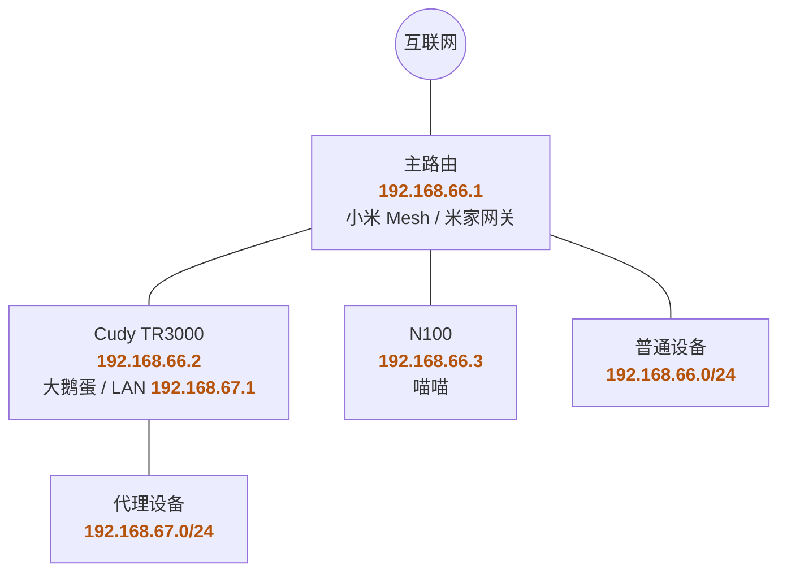
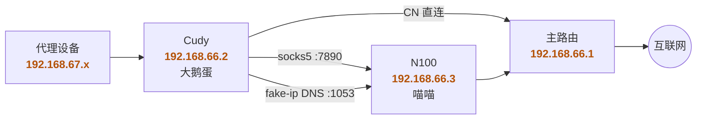

## 背景

先打个招呼：下文里的「大鹅」「大鹅蛋」「喵喵内核」，分别对应大家熟悉的那套透明代理组合。

之前我在 [Cudy TR3000 上吃过大鹅蛋](/2025/02/28/cudy-tr3000-daed-install-record/)。实习租房那会儿宽带只有 200Mbps，测下来代理下行能跑满，CPU 也看着还行，一度觉得这台小路由自己扛透明代理就够了。

离职回家以后带宽粗了不少，Cudy 就开始露馅：直连能跑满的速度，一走代理就掉下来。网口挺体面，真干活还是那颗小 SoC 扛不住加密解密和规则匹配。

内存也是坑。Cudy 只有 512MB，挂美西这种高延迟节点时，TCP 窗口会跟着 RTT 往上抬，缓冲区吃得很凶。同样的协议，亚太低延迟节点更容易把带宽打满，美西反而跑不满——最开始我还以为是节点质量问题，后来才发现小路由自己在添堵。

主路由我也不打算动。家里还靠小米官方系统做 Mesh，米家智能家居网关也压在它身上。代理调炸了事小，灯泡插座扫地机器人一起赛博失联就很难绷。主路由继续干拨号、Wi-Fi、DHCP、Mesh、米家，代理实验别往上塞。

最开始当然也想过 all in one，一个小盒子插上电就完事，多优雅。可惜家用网络里 all in one 离 all in boom 往往只有一次手贱更新的距离。于是现在改成半拆：主路由下面同时挂 Cudy 和 N100。Cudy 跑大鹅蛋当透明代理入口，先用 geosite / geoip 把 CN 流量直连出主路由；剩下的交给 N100 上的喵喵，DNS 也走它的 fake-ip。

## 网络拓扑

下面 IP 是示意用的，别和家里真实网段对号入座。

物理连接：



流量走向：



CN 在大鹅蛋这一层就直连出主路由。其余该走代理的流量，连同 fake-ip DNS 查询，一起交给 N100；其中 fake-ip 对应的 `198.18.0.0/16` 也必须走 socks5，别被 CN / private 直连规则误伤。

## 喵喵侧

N100 上开两个东西给 Cudy 用：`mixed-port` 暴露出来的 socks，以及 fake-ip DNS。为什么优先 fake-ip 而不是 real-ip，Sukka 这篇 [《谈谈 DNS 泄漏、CDN 访问优化与 Fake IP》](https://blog.skk.moe/post/lets-talk-about-dns-cdn-fake-ip/) 讲得很清楚，这里不展开；简单说就是响应速度更快、也少踩 CDN 调度的坑。简化版大概长这样：

```yaml
mixed-port: 7890
allow-lan: true
mode: rule
log-level: info
unified-delay: true

dns:
  enable: true
  enhanced-mode: fake-ip
  listen: 0.0.0.0:1053
  default-nameserver:
    - 223.5.5.5
  nameserver:
    - https://doh.pub/dns-query
    - https://dns.alidns.com/dns-query
  direct-nameserver:
    - 192.168.66.1
    - 119.29.29.29

proxy-providers:
  sub:
    type: http
    url: "https://example.com/sub/xxxxxxxx"
    interval: 21600
    path: ./providers/sub.yaml
    health-check:
      enable: true
      interval: 600
      url: http://www.gstatic.com/generate_204

rule-providers:
  lan:
    type: http
    behavior: classical
    format: text
    url: https://cdn.jsdelivr.net/gh/ACL4SSR/ACL4SSR@master/Clash/LocalAreaNetwork.list
    path: ./rules/lan.yaml
    interval: 86400
  proxylite:
    type: http
    behavior: classical
    format: text
    url: https://cdn.jsdelivr.net/gh/ACL4SSR/ACL4SSR@master/Clash/ProxyLite.list
    path: ./rules/proxylite.yaml
    interval: 86400
  chinadomain:
    type: http
    behavior: classical
    format: text
    url: https://cdn.jsdelivr.net/gh/ACL4SSR/ACL4SSR@master/Clash/ChinaDomain.list
    path: ./rules/chinadomain.yaml
    interval: 86400

proxy-groups:
  - name: 🚀 节点选择
    type: select
    proxies:
      - ⚡ 最低延迟
      - DIRECT
    use:
      - sub

  - name: ⚡ 最低延迟
    type: url-test
    url: http://www.gstatic.com/generate_204
    interval: 180
    tolerance: 50
    use: [sub]

  - name: 🎯 全球直连
    type: select
    proxies:
      - DIRECT

  - name: 🐟 漏网之鱼
    type: select
    proxies:
      - 🚀 节点选择
      - 🎯 全球直连

rules:
  - RULE-SET,lan,🎯 全球直连
  - RULE-SET,proxylite,🚀 节点选择
  - RULE-SET,chinadomain,🎯 全球直连
  - GEOIP,LAN,🎯 全球直连
  - GEOIP,CN,🎯 全球直连
  - MATCH,🐟 漏网之鱼
```

`allow-lan` 别关，DNS 监听 `0.0.0.0:1053`。直连域名的解析可以丢给主路由 DNS（示意里是 `192.168.66.1`），也可以留着不设置，或者是用阿里腾讯等常见的公共 DNS，不碍事。规则集和代理组实际比上面多，这里只留骨架。

## 大鹅蛋侧

Cudy 上用的是大鹅蛋图形界面。socks 指到 `192.168.66.3:7890`，DNS 指到 `192.168.66.3:1053`，N100 地址最好固定。


DNS 规则示意：CN 走普通解析，其他走喵喵拿 fake-ip。

```ini
upstream {
  mainrouter: 'udp://192.168.66.1:53'
  mihomo: 'udp://192.168.66.3:1053'
}

routing {
  request {
    qname(geosite:cn) -> mainrouter
    fallback: mihomo
  }
}
```

routing 规则如下，关键是把 fake-ip 网段强制送给喵喵：

```ini
routing {
    pname(NetworkManager, systemd-resolved, dnsmasq) -> must_direct

    dip(198.18.0.1/16) -> proxy

    dip(192.168.66.1/24) -> direct
    dip(geoip:private) -> direct
    dip(geoip:cn) -> direct
    domain(geosite:cn) -> direct
    fallback: proxy
}
```

`dip(198.18.0.1/16) -> proxy` 要写在 `domain(geosite:cn) -> direct` 和 `dip(geoip:private) -> direct` 前面。喵喵回的 fake-ip 都落在这个网段里；客户端随后连的也是这些假 IP。**如果不强制送过去，大鹅可能把流量判成直连**，结果去连一个根本不存在的 `198.18.x.x`。

至于要不要上这套半拆方案，看家宽和节点吧。公寓里那 200Mbps，Cudy 一个人吃鹅完全没问题；带宽一宽、再挂上美西，它就该找个打工人了。主路由继续当米家，Cudy 看门分流，N100 扛重活——至少现在，吃鹅这件事不用再让一台迷你路由单刷。

最后和大家道个歉：为了让博客在特定区域能多活一段时间，文里用了不少暗语，如果因此读起来有点跳戏，还请见谅。

## 参见

- [Cudy TR3000 吃鹅记](/2025/02/28/cudy-tr3000-daed-install-record/)
- [是什么，为什么，怎么做 —— 谈谈 DNS 泄漏、CDN 访问优化与 Fake IP | Sukka's Blog](https://blog.skk.moe/post/lets-talk-about-dns-cdn-fake-ip/)
- [daeuniverse/dae: eBPF-based Linux high-performance transparent proxy solution.](https://github.com/daeuniverse/dae)
