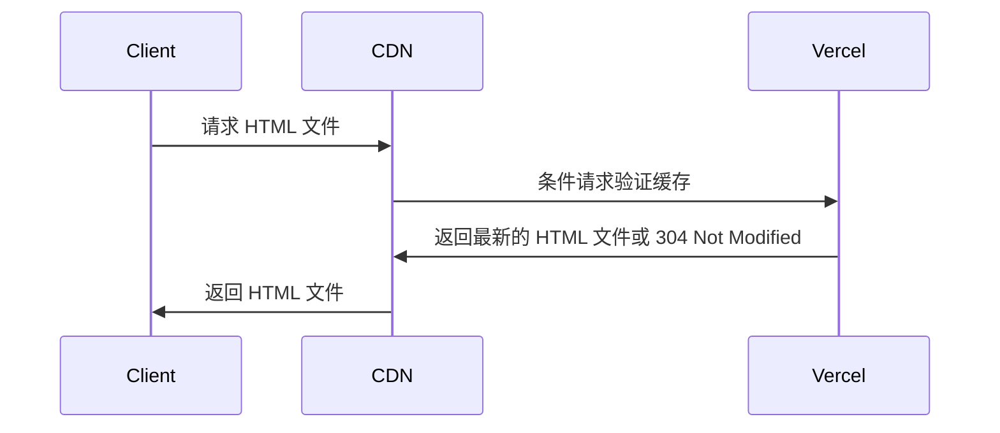
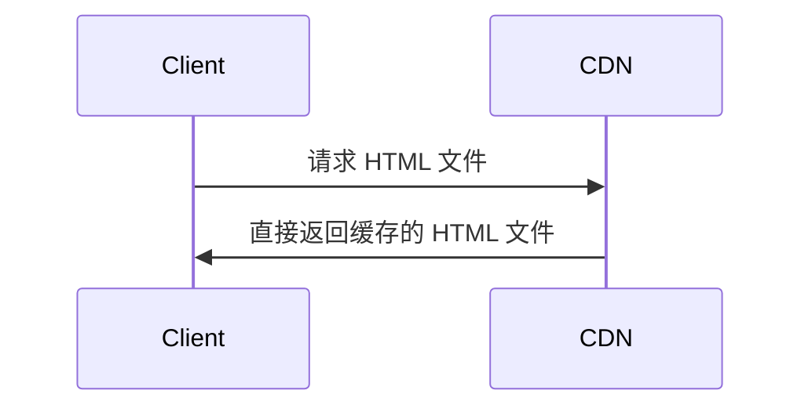

Vercel 默认的缓存配置其实并不合理，但鲜有人注意。

## 先看效果


## 分析

### 测试方案

这两张图都是我博客在 [PageSpeed Insights](https://pagespeed.web.dev/) 上测得的，测试步骤如下：

1. 部署
2. 在 PageSpeed Insights 进行第一次测试
3. 等待 120s，防止 PageSpeed Insights 拿之前的结果糊弄你
4. 进行第二次测试，取第二次测试的结果

**取第二次结果的目的是为了**让 PageSpeed Insights 所命中的 Vercel CDN 节点完成回源，并**将内容缓存在 CDN 节点上**，这样第二次访问的时候就会直接从 CDN 的缓存中得到结果，不需要回源。

那我们看图一的测试结果，正常吗？针对首页的单个 html 加载时长达到了 **450ms，看着不算慢，但其实细究下来是有问题的。**

Vercel 采用的是 Amazon 提供的全球 CDN 网络，在我们的首次访问之后，CDN 节点应当该已经缓存了首页的内容，第二次访问的时候应该是直接从 CDN 节点的缓存中获取内容。

### 合理的时长是多久呢？

- TCP 建立连接的三次握手，需要 1.5 个往返时延（RTT），再加上 TLS 1.3 握手的 1 个 RTT，共计 2.5 个 RTT。
- HTML 文件大小 18KB，初始拥塞窗口（IW）10 MSS ≈ 1460 字节 ≈ 14.6KB，理论上应该可以在两个 RTT 内传输完毕。

共计 4.5 个 RTT。

PageSpeed Insights 测试时使用的节点大概率是在美国，Amazon CDN 在美国的节点覆盖非常广泛，单个 RTT 时长控制在 5ms 以内绰绰有余，所以理论加载时长应该在 22.5ms 左右。加上 DNS 解析时长（这个也不多，因为两分钟前有过一次访问，这次不是冷启动）和一些不可控的网络抖动，**50ms 以内应该是完全没有问题的。**

**但实际测得的时长却高达 450ms，差了近 9 倍，这就很不合理了。**

我们再来看图二的结果，单个 HTML 加载时长降到了 41ms，完全符合预期。

为什么会有这么大的差异呢？原因就在于 Vercel 对缓存控制的设置上。

## Vercel 的缓存控制

在 Vercel 上部署的网站，默认情况下，Vercel 会对 HTML 文件设置如下的缓存控制头：

```
cache-control: public, max-age=0, must-revalidate
```

这个设置的含义是：
- `public`：响应可以被任何缓存区缓存，包括浏览器和 CDN。
- `max-age=0`： 响应的最大缓存时间为 0 秒，意味着响应一旦被缓存后立即过期。
- `must-revalidate`：一旦响应过期，缓存必须向源服务器验证其有效性。

结合这三个指令，Vercel 实际上是告诉 CDN 节点：你可以缓存这个 HTML 文件，但每次在使用缓存之前都必须回源验证其有效性。由于 `max-age=0`，缓存一旦存储就立即过期，因此每次请求都会触发回源验证。

尽管 HTTP/1.1 和 HTTP/2 中的缓存验证通常使用条件请求（如文件的 ETag 或 Last-Modified 头）来节省传输流量，但这仍然需要与源服务器进行往返通信，从而增加了额外的延迟开销。

所以，在 Vercel 默认配置下，任何请求的响应都不会被 CDN 节点直接缓存，大致的流程如下：



## 解决方案

要解决这个问题，我们需要调整 Vercel 上的缓存控制设置，使得 HTML 文件能够被 CDN 节点缓存一段时间，而不需要每次都回源验证。

Vercel 允许我们在项目的根目录下创建一个 `vercel.json` 文件以对 Vercel 的部署行为进行一系列的配置，其中就包括 HTTP 的响应头的配置。

我的博客采用 Nuxt.js 框架构建，生成的构建产物大概分为两类：

1. HTML 文件：这些文件的内容可能会频繁变化，不能设置过长的缓存时间；
2. 静态资源文件：包括 JavaScript、CSS 等，这些文件的文件名通常带有 hash 值，可以设置较长的缓存时间甚至被标记为不可变（immutable）。

在部署流程上，我的博客在每次推送后会先 Github Actions 中构建成静态页面，再部署到 Vercel 上，所以我在我项目的 public 目录下创建了 `vercel.json` 文件（这样 vercel.json 文件就会在构建产物的根目录），内容如下：

```json
{
  "headers": [
    {
      "source": "/(.*)",
      "headers": [
        {
          "key": "Cache-Control",
          "value": "public, max-age=0, s-maxage=600, must-revalidate"
        }
      ]
    },
    {
      "source": "/(.*)\\.(css|js)",
      "headers": [
        {
          "key": "Cache-Control",
          "value": "public, max-age=31536000, immutable"
        }
      ]
    }
  ]
}

```

这里我对所有的 CSS 和 JS 文件设置了 `max-age=31536000, immutable`，这样这些静态资源文件就可以被浏览器和 CDN 长时间缓存。而对于所有其他文件（主要是 HTML 文件），我设置了 `max-age=0, s-maxage=600, must-revalidate`，这样 HTML 文件就可以被 CDN 缓存 10 分钟，在这 10 分钟内的请求都可以直接从 CDN 节点的缓存中获取内容，而不需要回源验证。

这样一来，经过修改后的缓存控制设置，HTML 文件的请求流程变成了：



从而大大减少了请求的延迟，提高了页面加载速度。

## 其他

Vercel 所采用的架构并不是传统的 「源站 - CDN」 架构，而是更接近 「全球多区域存储 + CDN边缘缓存」 的架构，所以即使是回源请求，Vercel 也会尽量从离用户最近的存储节点获取内容，从而减少延迟。**但这并不意味着回源请求的延迟可以忽略不计，尤其是在追求极致的加载速度时，合理的缓存控制仍然是非常重要的。**

## 参见

- [Cache-Control headers | Vercel](https://vercel.com/docs/headers/cache-control-headers)
- [Vercel CDN Cache | Vercel](https://vercel.com/docs/cdn-cache)
- [HTTP caching - HTTP | MDN](https://developer.mozilla.org/en-US/docs/Web/HTTP/Guides/Caching)
